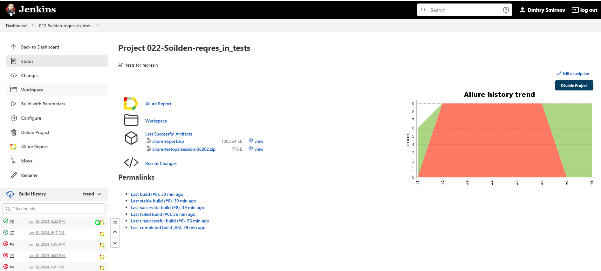
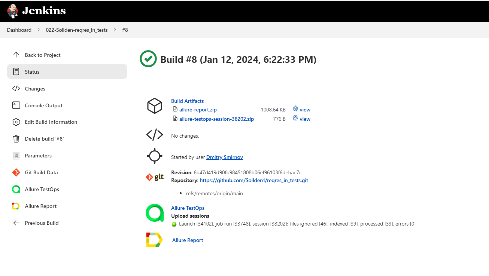
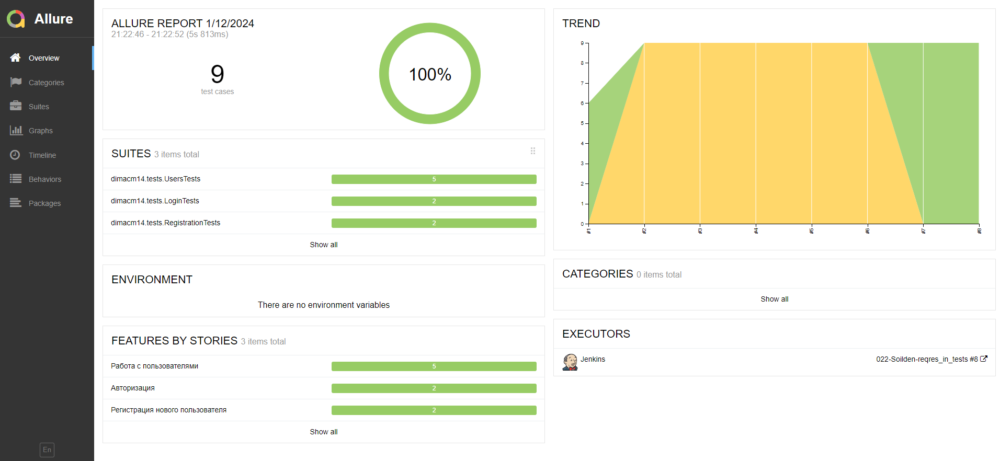
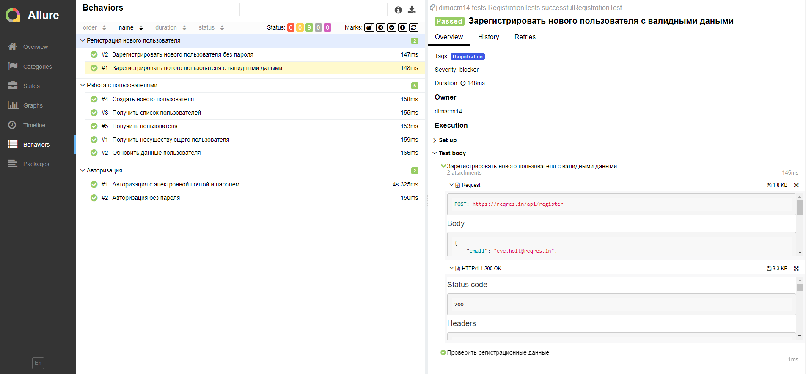
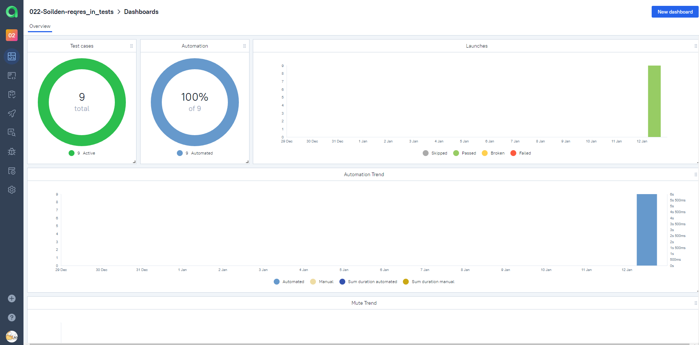
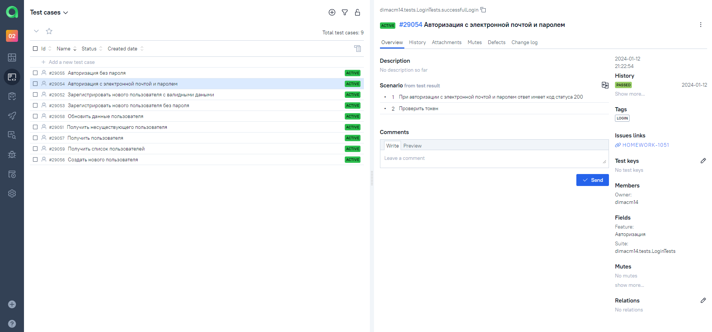
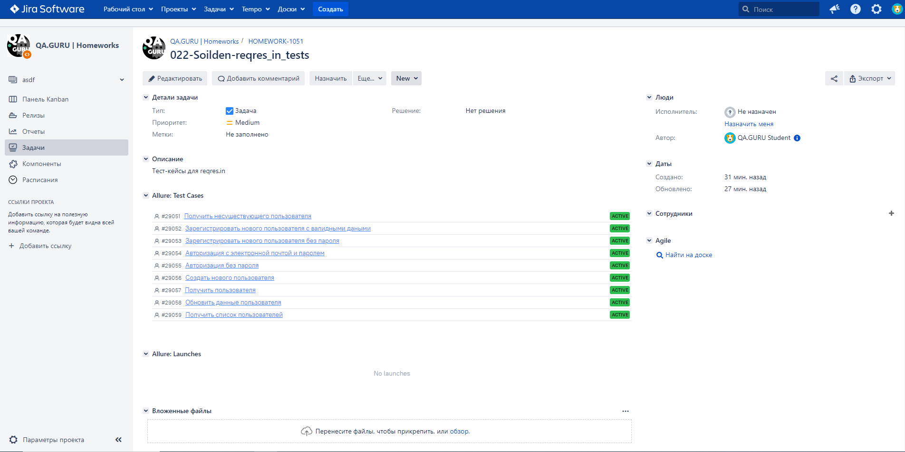
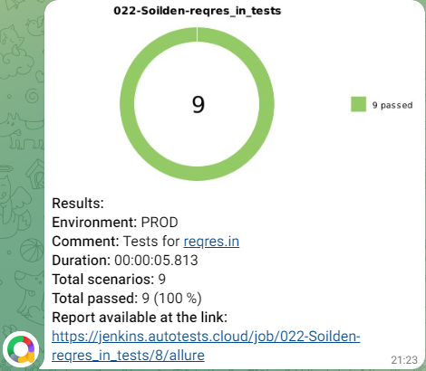

<h1 >Дипломный проект по тестированию API на <a href="https://reqres.in/">reqres.in</a></h1>


## :page_with_curl: Содержание

* <a href="#tools">Технологии и инструменты</a>

* <a href="#cases">Реализованные проверки</a>

* <a href="#console">Запуск тестов из терминала</a>

* <a href="#jenkins">Запуск тестов в Jenkins</a>

* <a href="#allure">Allure Report отчеты</a>

* <a href="#allure-testops">Интеграция с Allure TestOps</a>

* <a href="#jira">Интеграция с Jira</a>

* <a href="#telegram">Уведомления в Telegram</a>


<a id="tools"></a>
## Технологии и инструменты

| Java                                                                                                    | IntelliJ Idea                                                                                                                | Allure                                                                                                                    | Allure TestOps                                                                                                      | GitHub                                                                                                    | JUnit 5                                                                                                          | Gradle                                                                                                    | REST Assured                                                                                                             |                                                                                                         Jenkins | Jira                                                                                                                         |
|:--------------------------------------------------------------------------------------------------------|------------------------------------------------------------------------------------------------------------------------------|---------------------------------------------------------------------------------------------------------------------------|---------------------------------------------------------------------------------------------------------------------|-----------------------------------------------------------------------------------------------------------|------------------------------------------------------------------------------------------------------------------|-----------------------------------------------------------------------------------------------------------|--------------------------------------------------------------------------------------------------------------------------|----------------------------------------------------------------------------------------------------------------:|------------------------------------------------------------------------------------------------------------------------------|
| <a href="https://www.java.com/"></a> | <a id ="tech" href="https://www.jetbrains.com/idea/"></a> | <a href="https://github.com/allure-framework"></a> | <a href="https://qameta.io/"></a> | <a href="https://github.com/"></a> | <a href="https://junit.org/junit5/"></a> | <a href="https://gradle.org/"></a> | <a href="https://rest-assured.io/"></a> | <a href="https://www.jenkins.io/"></a> | <a href="https://www.atlassian.com/ru/software/jira"></a> |


<a id="cases"></a>
## :heavy_check_mark: Реализованные проверки

-  Создание нового пользователя
-  Получение списка пользователей
-  Получение пользователя
-  Обновление данных пользователя
-  Успешная/неуспешная регистрация пользователя
-  Успешная/неуспешная авторизация пользователя

<a id="console"></a>
##  Запуск тестов из терминала
### Локальный запуск тестов

```
gradle clean test  
```

<a id="jenkins"></a>
## </a> Запуск тестов в [Jenkins](https://jenkins.autotests.cloud/job/022-Soilden-reqres_in_tests/)

<p align="center">

> Для запуска сборки необходимо перейти в раздел "Build with Parameters" и нажать кнопку "Build".

<a href="https://jenkins.autotests.cloud/job/022-Soilden-reqres_in_tests/"></a>

> При клике на сборку после завершения можно увидеть артефакты запуска и полезные ссылки для более детального изучения прогона.

<a href="https://jenkins.autotests.cloud/job/022-Soilden-reqres_in_tests/8/"></a>
</p>

<a id="allure"></a>
## </a> [Allure Report](https://jenkins.autotests.cloud/job/022-Soilden-reqres_in_tests/8/allure/) отчеты

### Основное окно

<p align="center">
<a href="https://jenkins.autotests.cloud/job/22_Bubalov_FinalProject_Api/10/allure/"></a>
</p>

### Отчеты по тестам

<p align="center">

> В отчете по тестам присутствует развернутая информация по запросам и ответам.

<a href="https://jenkins.autotests.cloud/job/022-Soilden-reqres_in_tests/8/allure/#behaviors"></a>
</p>

<a id="allure-testops"></a>
## </a> Интеграция с [Allure TestOps](https://allure.autotests.cloud/project/3967/dashboards)

### Основное окно

<p align="center">
<a href="https://allure.autotests.cloud/project/3967/dashboards"></a>
</p>

### Автотесты в Allure

<p align="center">

</p>

<a id="jira"></a>
## </a> Интеграция с [Jira](https://jira.autotests.cloud/browse/HOMEWORK-1051)

<p align="center">
<a href="https://jira.autotests.cloud/browse/HOMEWORK-1051"></a>
</p>

<a id="telegram"></a>
## </a> Уведомления в Telegram

<p >

> С помощью настроенного бота после завершения прогона в Jenkins поступают уведомления в Telegram.


</p>
